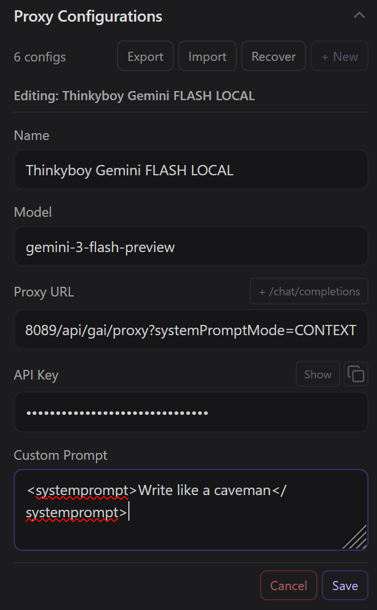
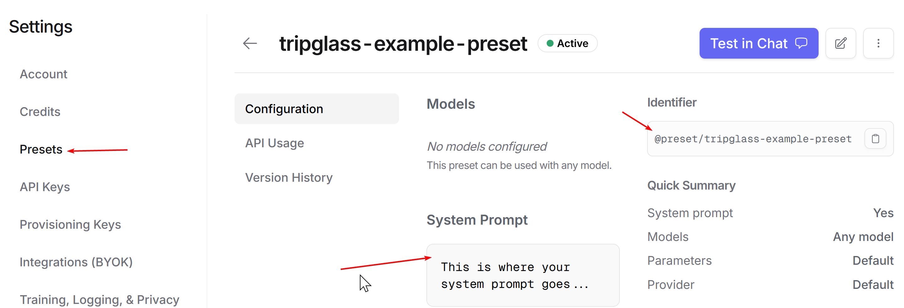
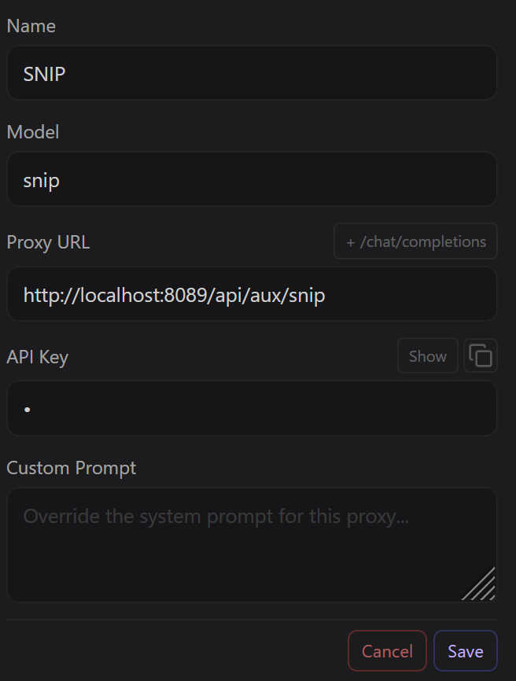
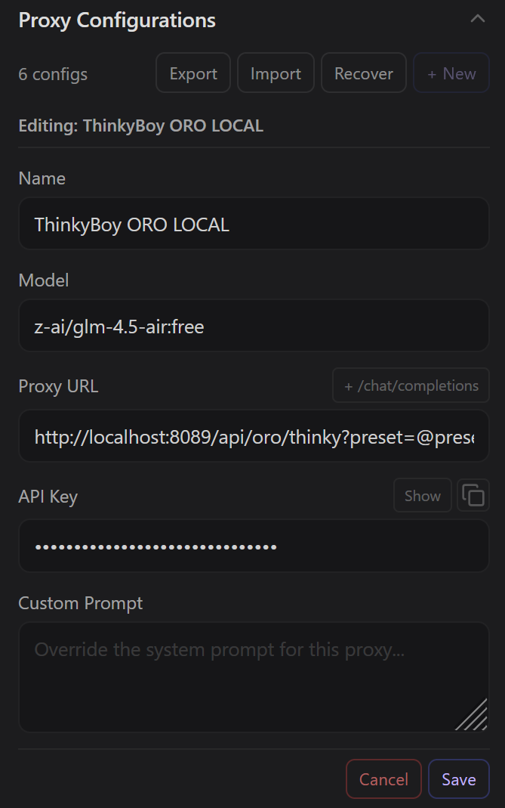

# JAIPuR OXY

Proxy for interfacing JanitorAI with a bunch of other LLM APIs **primarily** to:
- enable reasoning, e.g. with models that can do both
- make JanitorAI communicate with Gemini

This proxy works for:
- OpenRouter
- Z.AI
- Google AI Studio/Gemini

## Adding Reasoning

Reasoning makes for more consistent and coherent responses.

Some models offer both reasoning and non-reasoning modes, and some APIs let the user enable reasoning by setting an option in the request body. Since JAI doesn't let you add options to the request at will, this proxy accepts your request, slaps on the required parameter to enable reasoning, and passes it on. 

This is currently implemented for:
- OpenRouter.AI
- Z.AI
- Gemini by setting `reasoningEffort` to a concrete token amount (only makes sense for the `flash` model since it has both reasoning and non-reasoning modes)

## Gemini

### API Support

Gemini has a different API than e.g. OpenRouter. JAI does not support Gemini's request/response format out of the box, so this proxy does the translation. 

### Reasoning 

Reasoning behaviour depends on the used model: 

- `pro` always reasons, so it does not have to be enabled. 
- `flash-lite` is incapable of reasoning. 
- `flash` can be made to reason circumstantially via prompt, or forced by allotting a certain amount of reasoning tokens to the request. 

The API of this proxy experimentally offers the option to set the used reasoning tokens to a specific number with the parameter `reasoningEffort`, which is supported by `flash` and `pro`. This should force reasoning in `flash` (although it will likely not reason on the same level as `pro`). While reasoning is always active for `pro`, this can serve to fine-tune reasoning effort and total tokens (i.e. cost).

### Unblock Content Filters

This proxy sets Gemini's content filters to the most permissive setting so we can play like adults. It's your own responsibility to make sure you're not breaking Gemini's Terms of Service.

### System Prompt

This proxy additionally supports setting a **system prompt**, which will make Gemini adhere more strictly to your instructions. 

Heuristic checks are stricter for Gemini's `systemInstruction` parameter than message contents and appear independent from safety settings. If you keep getting a `PROHIBITED_CONTENT` response independent of chat content, chances are that the checks detected something in your instructions that they identify as designed to break Gemini's ToS. In that case, try to rephrase your instructions. (Funnily enough, Gemini can help you with this if you describe your problem and paste your instructions in the app.)

There are two options for passing along a system prompt:

#### CONTEXT

With this option, you can use the **Custom Prompt** field in your JanitorAI proxy configuration to pass along a system prompt: Simply enclose your instructions in the tags `<systemprompt>...</systemprompt>` and they will be passed along as `systemInstruction` for Gemini. 

(Technically, this option looks at the first message and loads whatever between the first instance of `<systemprompt>...</systemprompt>` it can find, so multiples won't do anything. To save on tokens, the first instance of `<systemprompt>...</systemprompt>` will then be removed from the first message before passing it along.)

#### LOCAL

This option uses the system prompt inside `systemprompt.md` on the server's local file system. If you're running this locally or making your own deployment, you can use this for your own prompt, or just use my instruction set for shits and giggles.

## OpenRouter 

### Presets

This proxy supports using **OpenRouter presets**. You can set those up your OpenRouter settings under **Presets**. Use those to set the **system prompt** on OpenRouter, select and exclude providers, and more. (Disappointingly enough, a preset in itself does not support setting the `reasoning` flag.) You will need the full identifier to use it with JAIPuR.

Not all OpenRouter models seem to support this (I think it's about the system prompt but I could be wrong), so if you keep getting a request format error, try disabling the preset and inserting your prompt into JAI's *Custom Prompt* field.

### Reasoning effort

Some models on OpenRouter allow for more granular configuration of reasoning. This proxy experimentally lets you pass along a reasoning effort level to the model: Options are `minimal`, `low`, `medium`, `high` and `xhigh`. If the model only supports setting a discrete number of reasoning tokens, this number will apparently be calculated based on this option? Feel free to peruse the [OpenRouter docs on reasoning](https://openrouter.ai/docs/guides/best-practices/reasoning-tokens#reasoning-effort-level) for more information.
 

## Z.AI Chat & Coding endpoints

This proxy supports using either the regular Z.AI chat completions endpoint or the special `/coding` API included with a coding subscription. If you keep getting error `429` when using the `/chat` endpoint, you probably want the `/coding` one.

## Utility

Sometimes I get a fantastic response where the overall progression is agreeable-- but the thing is just too goddamn long and needs an opportunity for my own post in the middle. That's why I added a `/snip` endpoint. If you set your proxy to this endpoint, JAIPuR checks the last bot response and user response for a `<SNIP>` tag and "splits" the post, responding with the content following the first `<SNIP>` it could find. (The tag needs look exactly like that.) 

So, for example, if your user post looks like this:
`"Hello!" I waved.<SNIP> Branco glowered.`

The `/snip` endpoint will give the following response:

`Branco glowered.`

(You will still have to delete the duplicate text in a manual edit, though.)

To use it, set your proxy just for the next response to the `/snip` endpoint. (The values other than *Proxy URL* don't matter, except it refuses to comply with API key being left empty.)

My motivations:
- I don't necessarily like editing bot responses to add my character's reactions (especially from their perspective) because I feel some LLMs "learn" from that and start ignoring my instruction to not write for my character.
- Sometimes LLM responses generally get too long. Hacking them into pieces gives the LLM reference for shorter post formats which, again, I feel it picks up on.

# Use

JAIPuR has to be running somewhere. See [Run Locally](#run-local) on instructions on how to start it on your machine. 

Once it is running, you can configure your proxy normally: Set the URL and use the endpoint for the provider you need, optionally add query parameters, enter the model name as it used by this provider, and add your API key for this provider. You will have to additionally disable "Text Streaming" in the options because JAIPuR does not support this.

Here's the [Swagger-UI](https://tripglass.github.io/jaipuroxy/)

Here are some examples:

**Gemini:**

`/api/gai/proxy` 

Use Google AI/Gemini API. Whether reasoning is enable depends on the model. No system prompt is set (but everything is passed along normally). 

`/api/gai/proxy?systemPromptMode=CONTEXT` 

Use Google AI/Gemini API. System prompt will be set from whatever is between `<systemprompt>...</systemprompt>` tags in your **Custom Prompt** settings.

`/api/gai/proxy?reasoningEffort=1024`

Use Google AI/Gemini API. Sets a predetermined number of tokens the model may use for reasoning, if you are using a model that is capable of reasoning. Setting this to a positive integer forces Gemini `flash` models to reason, improving response quality. Remember that this does not work for `flash-lite` models, since those do not support reasoning.

Range for `flash`: 0 to 24576 
Range for `pro`: 128 to 32768
-1 lets the model decide (but in that case you can also leave out the parameter).

`/api/gai/proxy?logReasoning=true` 

Use Google AI/Gemini API. No system prompt is set. Log reasoning results (if available) to local console. (This only benefits you if you're running the server locally.)

`/api/gai/proxy?systemPromptMode=LOCAL&logReasoning=true` 

Use Google AI/Gemini API. System prompt is loaded from `systemprompt.md` on server file system. Log reasoning results (if available) to local console. (This only benefits you if you're running the server locally.)

**OpenRouter:**

`/api/oro/thinky`

Use OpenRouter API, enable reasoning. Make sure you're using a model that supports reasoning or else this proxy does nothing.

`/api/oro/thinky?reasoningEffort=high`

Use OpenRouter API, enable reasoning. Sets reasoning effort to high for models that support it. Available values:  "minimal", "low", "medium", "high", "xhigh"

`/api/oro/thinky?preset=@preset/tripglass-wurstsalat`

Use OpenRouter API, enable reasoning and use OpenRouter preset `@preset/tripglass-wurstsalat`.

`/api/oro/thinky?preset=@preset/tripglass-wurstsalat&logReasoning=true`

Use OpenRouter API, enable reasoning, use OpenRouter preset `@preset/tripglass-wurstsalat`, log reasoning results (if available) to local console. (This only benefits you if you're running the server locally.)

`/api/oro/thinky?logReasoning=true`

Use OpenRouter API, enable reasoning, log reasoning results (if available) to local console. (This only benefits you if you're running the server locally.)

**Z.AI:**

`api/zai/thinky/chat`

Use `/chat/completions` endpoint on Z.AI for request, enable reasoning.

`api/zai/thinky/coding`

Use `/coding` specific API on Z.AI for request, enable reasoning.

`api/zai/thinky/coding?logReasoning=true`

Use `/coding` specific API on Z.AI for request, enable reasoning, log reasoning results to local console. (This only benefits you if you're running the server locally.)

**Utility:**

`api/aux/snip`

"Snip" a post in two: Both the last bot response and the last user response are checked for whether they contain `<SNIP>` (in this order). The contents of the first response containing `<SNIP>` are split up around `<SNIP>`. The endpoint returns a new bot response with the content coming after `<SNIP>`. (You'll still have to manually edit out the duplicate text, though.)

# About this project

## Stack

Base technologies are Node & TypeScript. API is built on express & tsoa, proxy calls use axios and the Google GenAI SDK. Logging is done with pino, testing with vitest.

## Run Local {#run-local}

You're gonna need `Node.js` and `npm` on your system to run this project locally.

`npm i` to install dependencies, then either:

`npm run dev` (for debug mode on a Windows machine that's like mine and needs a little kick in the ass for UTF-8, comes with pretty logs)

Or:

`npm run start` (for regular mode)

After changes to the API, you have to regenerate routes with `npm run tsoa:gen`

The environment variable `PINO_LOG_LEVEL` controls the level of logs this application outputs. Log level defaults to `debug` (unless your `NODE_ENV` is mysteriously set to `production`, in which case the level is `info`). Logs with identifiable content (e.g. start of transmitted context window of posts) happen at `debug` level. 

## Questions

### Why no Chutes.ai?

Last time I checked, the Chutes.ai API did not offer a flag for users to explicitly enable reasoning for a request. Instead, it probably depends on the model whether some magic is happening or reasoning just never gets activated. Either way, it looks like my proxy **can't** help here.

### Why no provider XY?

I focused on the providers I use. Adding another provider depends on:
- someone requesting it 
- the provider's API docs being comprehensible
- me easily getting an API key for testing
- me having the time to implement it

### Why use this when XY exists?

Dunno? Compare the features and the code (if the full source is publically available) and decide for yourself. I'm not trying to sell you JAIPuR, I'm just putting it online because I've been using it anyway lol.

### Why build this when XY exists?

- I have simple needs
- I like knowing what code does, which is easiest when I have written it 
- I like messing around and experimenting
- I am a developer

### What happens with my API keys?

The code itself doesn't log or store them, just passes them through. The rest depends on where the code is run. If you want maximum peace of mind, just run JAIPuR locally.

### Why "JAIPuR"?

JAI P(u)ROXY. I... like puns...

## Expectation Management

I work on this for my own purposes in my own time, since I have a day job. I accept feature requests but will probably prioritise them in accordance with my brainworms. While I don't expect merge requests, I'm open to them. I will try to keep the API stable because I'm not a monster.

## Disclaimer

You're free to deploy this code, pilfer it for parts or do whatever. As far as I know, this code does not violate the ToS of JanitorAI, OpenRouter, Google AI Studio or Z.AI, and it wasn't designed to. I don't take responsibility for what other people use this code for or what happens then (e.g. costs incurred, something breaking, getting in trouble). Just know what you're doing.

## License

This code is provided under the MIT License.

Copyright 2025 tripglass

Permission is hereby granted, free of charge, to any person obtaining a copy of this software and associated documentation files (the “Software”), to deal in the Software without restriction, including without limitation the rights to use, copy, modify, merge, publish, distribute, sublicense, and/or sell copies of the Software, and to permit persons to whom the Software is furnished to do so, subject to the following conditions:

The above copyright notice and this permission notice shall be included in all copies or substantial portions of the Software.

THE SOFTWARE IS PROVIDED “AS IS”, WITHOUT WARRANTY OF ANY KIND, EXPRESS OR IMPLIED, INCLUDING BUT NOT LIMITED TO THE WARRANTIES OF MERCHANTABILITY, FITNESS FOR A PARTICULAR PURPOSE AND NONINFRINGEMENT. IN NO EVENT SHALL THE AUTHORS OR COPYRIGHT HOLDERS BE LIABLE FOR ANY CLAIM, DAMAGES OR OTHER LIABILITY, WHETHER IN AN ACTION OF CONTRACT, TORT OR OTHERWISE, ARISING FROM, OUT OF OR IN CONNECTION WITH THE SOFTWARE OR THE USE OR OTHER DEALINGS IN THE SOFTWARE.
